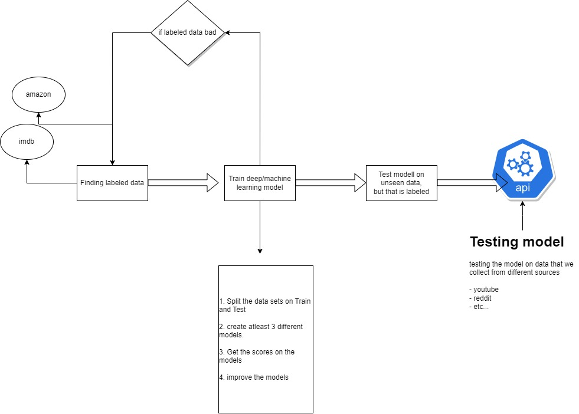

# Graduation Project - irato
[@Aliti-Coding](https://github.com/Aliti-Coding),
[@mats-bb](https://github.com/mats-bb),
[@duggurd](https://github.com/)

# Contents
- [Graduation Project](#graduation-project)
- [Contents](#contents)
- [1. Sentiment Analysis](#1-sentiment-analysis)
  - [1.1. Social Media Platforms](#11-social-media-platforms)
  - [1.2. News Outlets](#12-news-outlets)
  - [1.3. Business Value](#13-business-value)
- [2. Data](#2-data)
  - [2.1. Data Sources](#21-data-sources)
  - [2.2. Database](#22-database)
- [3. Machine Learning](#3-machine-learning)
- [4. Visualization](#4-visualization)
- [5. Sources](#5-sources)

# 1. Sentiment Analysis
The basic premise is to create a model that can evaluate a piece of text's sentimental properties, ie. what underlying emotions does the piece of text convey. A decision needs to be made wether to classify purely based on "good" and "bad" or to classify more emotions *[1](#5-sources)*. Furthermore, decide to treat the problem as a binary classification problem or as a regression problem with gradients of emotions.

Additionally, a text-summarization algorithm is to be implemented, so far we have looked at *term frequency–inverse document frequency [2](#5-sources)* (TF-IDF). This algorithm is to be applied to each "document" or each piece of text to extract the most important keyword or keywords from the text.

Targeting english text.

## 1.1. Social Media Platforms
Apply the trained model to analyze different social media plattforms for their intrinsic emotions, comparing them and also doing an analysis over time within each platform. Looking at intrinsic emotions of specific tags and topics. 

## 1.2. News Outlets
Proof of concept case. Applying the model on different news article outlets and comparing their sentimental values for the same covered event. 

Idea could be further used to classify political orientation of different news outlets and individual articles, but out of scope for this project.

## 1.3. Business Value
The main goal of the project is to implement a sentiment analysis model that can be used on any piece of english text. As a creator on for example YouTube the model could be used to analyse comments over time to pinpoint potential problems with content without needing to read all the comments.

The same principle could be applied to a companies reviews for products and services to summarize the sentiment and to give a deeper insight into where a potential problem lies, its cause or it could give insight into which actions make a difference.

# 2. Method

*Proposed iterative method until production ready.*

The foundation and core of the project is the data.

# 3. Data
Two sets of data are required to fulfill our vision for the project.

Firstly a set of training data, which has two requirements. One, it is a piece of english text, and two, there exists some kind of labeling corresponding to the text encoding its sentimental value. For a binary classification approach that could be simply a yes or no if the text is negative or not. For a regression problem reviews with belonging scores could be used. 

Secondly the data to use for analysis. For the [social media platforms](#11-social-media-platforms) case, that would be posts from different social media platforms, and for the second case, [news article outlets](#12-news-outlets) news articles from different sources covering the same topic or event.

## 3.1. Data Sources
[Data sources](https://github.com/duggurd/graduation_project/blob/main/data_sources.md).

So far we have been looking at two main sources for training data. [IMDB](https://www.tensorflow.org/datasets/catalog/imdb_reviews), providing a large amount of reviews with  ratings and a pre-labeled [twitter dataset](https://www.kaggle.com/datasets/yasserh/twitter-tweets-sentiment-dataset).

Another source or metric that could be used to derive the sentiment of a piece of text is a dictionary of words with correlated emotion like the [NRC lexicons](https://nrc.canada.ca/en/research-development/products-services/technical-advisory-services/sentiment-emotion-lexicons) with both binary and multiple emotion labeled words. A pure lexicon approach could be problematic as context is important when it comes to sentiment. A statement could have completely different underlying sentiment in different circumstances, a seemingly neutral sentence could be negative in some contexts.

On the analysis side we have looked at ways to collect social media posts from [Rwitter](https://twitter.com/), [Facebook](https://www.facebook.com/), [Reddit](https://www.reddit.com/) and [YouTube](https://youtube.com) for the social media case. [New York Times](https://www.nytimes.com/), [Fox News](https://www.foxnews.com/), [CNN](https://edition.cnn.com/) and [Abc News](https://abcnews.go.com/) (politically diverse news outlets) for the news outlet case, where web scraping will be necessary to collect the data.

## 3.2. Database
Azure Cloud hosted database. At least 2 tables, one for social media posts and one for news article outlets. Depending on the method used to train the model a third might be necessary to store the training data. The social media data needs to be normalized to fit one schema, the same for the news articles.

# 4. Machine Learning
Multiple different types of models that could be used. The choice will depend on the training, how much of it is available and the target value/values to predict. If there is a lot of available data a deep learning model could be the best choice, an LSTM or a Transformer model would probably be the best choices. If there are fewer samples of training data or for a less complex model machine learning models could be used like a Support Vector Machine model.

# 5. Visualization
Ideas:
- Sentiment over time
- Location based 
- Per person based
- Platform (twitter, reddit, etc) based
- News outlet based

# 6. Sources
1. https://medicalxpress.com/news/2023-02-joy-caf-tweets-reveal-cities.html
2. Wikipedia. "tf-idf". wikipedia.com. https://en.wikipedia.org/wiki/Tf%E2%80%93idf.